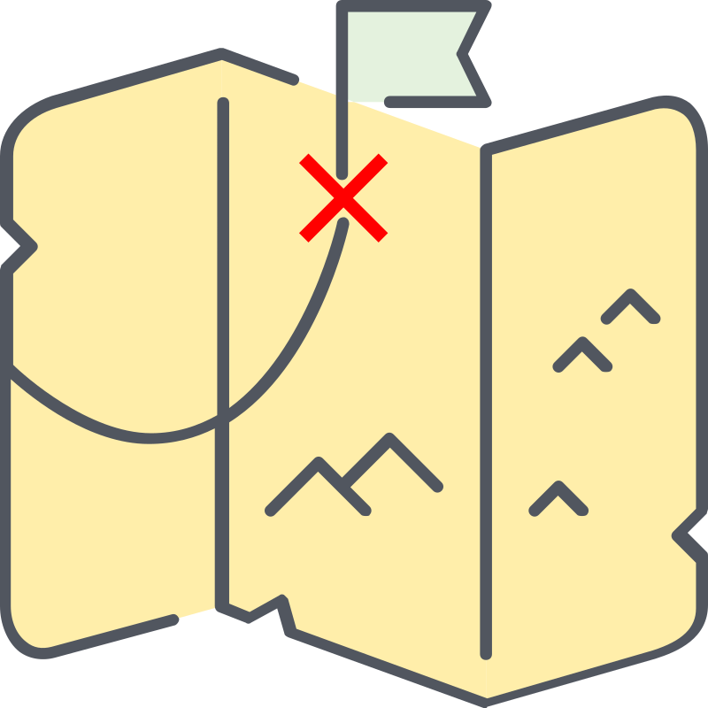

```{toctree}
:maxdepth: 2
:caption: Home
:hidden:

content/index
```

<!--Start of Tawk.to Script-->
<script type="text/javascript">
var Tawk_API=Tawk_API||{}, Tawk_LoadStart=new Date();
(function(){
var s1=document.createElement("script"),s0=document.getElementsByTagName("script")[0];
s1.async=true;
s1.src='https://embed.tawk.to/63da4028c2f1ac1e2030c5e3/1go68l7fv';
s1.charset='UTF-8';
s1.setAttribute('crossorigin','*');
s0.parentNode.insertBefore(s1,s0);
})();
</script>
<!--End of Tawk.to Script-->


<br>
<br>

:::{image} _static/Title/Graffity/Graffity-title1.png
:width: 100%
:::

<br>
<br>
<br>

***

<br>

:::::{grid} 2

::::{grid-item}
:columns: 8

```{epigraph}

Hiphop is one of the most influencial <strong>socio-cultural</strong> movement since it's inception in New York in the early 70's. It has now spread all over the world and have taken mutiple form by being embraced by various countries and cultures.

<br>

- Good start but to complement

Your own story is better than the one generated by IA ... 

```   

<br>


::::


::::{grid-item}
:columns: 4

:::{image} _static/Logo/HLA-Logo.png
:width: 400px
:::

```{admonition} To do
:class: warning, dropdown

This is a sketch of our project logo, it needs to be done more professionaly:

- Who ? 

**You ?** 

```

<br>
<br>


:::::


# 🌍 **Web-Journal**

<br>

:::{image} _static/Photos/IMG_4028.jpg
:width: 100%
:::

<br>
<br>


:::::::{grid} 2

::::::{grid-item}
:columns: 6

<p>Hiphop Living Arxiv is a project that is in its early stages of development and has been set up by academic Vincent Deguin with the assistance of Hiphop practitioner Barry Watson (Kraze One). The two colleagues became friends while working/studying at the Open University Milton Keynes where they both contributed to several community events centered around local Hiphop culture. Eventually, after several in depth conversations around the emerging links between Hiphop culture and academia, they created an online space to enable them to build on their ideas, giving birth to this website. 
</p>

<p>
The aim is to provide a plateform, resource and reference point for the knowledge that has been and is in the process of being documented by the global hophop community. 
</p>

```{note}


- Important paragraph about what I try to achieve:
New way to create and sustain social connections using the internet.
I think a lots of time, effort, and content is given and lost on social media. I would like to create a new web-plateform that promote a different kind of dialogue.


```

<p>
The team are in ...
</p>

::::::

::::::{grid-item}
:columns: 6

<p class="emphase2">   
<strong>Editors </strong> 
</p> 

:::::{grid} 2

::::{grid-item-card}
:link: https://deugz.github.io/sp-Hiphop_Journey/build/html/content/Community/Peoples/Vincent_Deguin/Vincent_Deguin.html
:class-header: bg-light
**Deugz**

^^^


:::{image} _static/Profile-pic/profile-pic-round.png
:width: 100%
:::

+++

🎤

::::

::::{grid-item-card}
:link: https://deugz.github.io/nb-profile/_build/html/intro.html
:class-header: bg-light

**Kraze One**

^^^


:::{image} _static/Profile-pic/Barry-round.png
:width: 100%
:::


+++

🎤 - 💽


::::

:::::


<br>

```{admonition} You maybe?
:class: warning, dropdown

Explain collaborative ... We are looking for ...

```


<br>
<br>

***

<p class="emphase2">   
<strong>Objectifs</strong> 
</p> 

<p class="emphase">   
<strong> For me</strong> 
</p>

***

<br>

::::{grid} 4

:::{grid-item}

<span class="hovertext" data-hover="I am trying to experiment with how research can be made interactive and entertaining for the general public (within which I count all researchers) ">  </span>

:::

:::{grid-item}

 <span class="hovertext" data-hover="I am trying to experiment with how research can be made interactive and entertaining for the general public (within which I count all researchers) ">  </span>

:::

:::{grid-item}


<span class="hovertext" data-hover="I am trying to experiment with how research can be made interactive and entertaining for the general public (within which I count all researchers) ">  </span>
 
:::


:::{grid-item}

 <span class="hovertext" data-hover="I am trying to experiment with how research can be made interactive and entertaining for the general public (within which I count all researchers) ">  </span>

:::

::::

<br>
<br>

:::::{dropdown} ✅ Online note taking method 

Explain Jupyter Book etc ... (cf below)

:::::

:::::{dropdown} ✅ To write, display, archive and link content

Explain Jupyter Book etc ... (cf below)

:::::

:::::{dropdown} 🚩 Bring people together

:::::

:::::{dropdown} ✅ For Colaborative story telling

::::{tab-set}

:::{tab-item} Deugz 🥖

Bienvenue sur ce projet, 

I am trying to experiment how we can create meaningfull connections via the internet


:::

:::{tab-item} Barry 💂

```{admonition} Barry 

To do:

```

:::

:::{tab-item} ? 🍺
My second tab with `some code`!
:::


::::

:::::


:::::{dropdown} 🚧 Open & transparent Peer Review 

Explain Jupyter Book etc ... (cf below)

:::::

<br>
<br>

<p class="emphase">   
<strong> You! </strong> 
</p>

```{admonition} OU Conference 2023
:class: warning, dropdown

I have created 1 website for each of you, check (link)

```

***

<br>


::::{grid} 4

:::{grid-item}

<span class="hovertext" data-hover="Drop your treasure down, and watch people digg it! ">  </span>

:::

:::{grid-item}

<span class="hovertext" data-hover="Find yourself on the map (Can be quite tough and confusing at first but relax, explore and you will find your way)">  </span>


:::

:::{grid-item}


 <span class="hovertext" data-hover="Collaborate">  </span>


:::

:::{grid-item}

<span class="hovertext" data-hover="Drop your treasure down, and watch people digg it! ">  </span>

:::


::::

<br>
<br>

:::::{dropdown} ✅ Archiving tool

Explain Jupyter Book etc ... (cf below)

:::::


:::::{dropdown} 🚧 Social Network

Explain Jupyter Book etc ... (cf below)

:::::

<br>
<br>


<p class="emphase">   
<strong>And the Community! </strong> 
</p>

***

<br>


::::{grid} 4

:::{grid-item}

<span class="hovertext" data-hover="Explore">  </span>

:::

:::{grid-item}

 <span class="hovertext" data-hover="Enjoy">  </span>

:::

:::{grid-item}

<span class="hovertext" data-hover="I am trying to experiment with how research can be made interactive and entertaining for the general public (within which I count all researchers) ">  </span>

:::

:::{grid-item}


<span class="hovertext" data-hover="Learn"><span class="hovertext" data-hover="Communicate">  </span>
</span>
:::


::::

<br>
<br>

:::::{dropdown} ✅ Digg

Explain Jupyter Book etc ... (cf below)

:::::


:::::{dropdown} 🚧 Learn

Explain Jupyter Book etc ... (cf below)

:::::


::::::


:::::::

<br>
<br>

<p class="emphase">   
<strong>Together</strong>, create and sustain a <strong>constructive dialogue </strong> to build an
</p> 

<p class="emphase2">   
<strong>Encyclopedia </strong>
</p>

::::{grid} 2

:::{grid-item}
:columns: 6

About **Hiphop**.


:::

:::{grid-item}
:columns: 6

<div class="embedresize">
<iframe width="100%" height="auto" src="https://www.youtube.com/embed/G8wm7EKKyuY?si=F8Yg_JhCdceMSNC4" title="YouTube video player" frameborder="0" allow="accelerometer; autoplay; clipboard-write; encrypted-media; gyroscope; picture-in-picture; web-share" allowfullscreen></iframe>
</div>


:::

::::

<br>

```{note}

**To Do**

Create our own video showing github push expanding (Gource)
- create a bit and a rap to quickly explain the project as background music (40s).

```

<br>

::::{tab-set}  

:::{tab-item} Creative 

And Innovant:

- The Web 3.0 is ...  It allow for ...
- Semantic web

```{note}

- create **knowledge graph** 
    - svg or web

```

:::    
   

:::{tab-item} Online documentation

Markdown

:::

:::{tab-item} Free & Open Source

Accessible to all
Uses the following technologies
- [JupyterBook]()
- [Github]()


:::

:::{tab-item}  Participative 

Everybody can contribute. Rather than sharing using classical social media, why not share your content in a more **constructive** way

- Inclusive   

Social Network
Strong connections

:::

:::{tab-item} For the 🌍


Practitioners, archivist, Hip hop enthusisats ... All together interacting in a dedicated web plateform to construct something meaningfull.

:::


 

    
    
:::{tab-item} Independant

Self-managed, Anarchist, No governance, freedom

This project is also an experiment in many aspects:
- How to create a community online
    
:::
    
    
:::: 


<br>

<h3>Archiving Hip Hop: 50 years in the making</h3>

:::::::{grid} 2

::::::{grid-item}
:columns: 7

```{note}

Let's unpack these crazy photos and recording to use this wonderfull event as our first source of archive

```


<h4>What's next ?</h4>


::::::


::::::{grid-item}
:columns: 5

<script src="https://unpkg.com/@dotlottie/player-component@latest/dist/dotlottie-player.mjs" type="module"></script> 
<dotlottie-player src="https://lottie.host/97e42080-d9a1-4db3-bf7e-c14279ab0666/8VXBPW4O4g.json" background="transparent" speed="1" style="width: 300px; height: 300px;" loop autoplay></dotlottie-player>


::::::

:::::::


<br>
<br>


<br>


# **Hiphop**

<p class="emphase2">   
<strong>Nation </strong> 
</p> 

:::::::{grid} 

::::::{grid-item}
:columns: 8


```{note}

Describe here the scope of the project

**To do**:

- The idea is to keep a discussion channel open between us. I have created one web page for each person present and speaking at the conference (link). I have included your name, the abstract of your talk and the video presentation. If you want this not to appear here, please let me know, and if you want me to add some more informations or content (pictures, links, bio ...) let me know as well. Remember that you can use 3 different methods to interact (explained above). 

- Before to start archiving, one need to **Collect** first. And this is where I need your help, I provide the structure, the frame, but you must contribute to the content. There is a constellation of people embracing The Hiphop vibes and culture in many different ways, and every story must be told to start envisioingn the impact of a social movement.    

```


::::::


::::::{grid-item}
:columns: 4


<p class="emphase">   
<strong>Do more than this:</strong> 
</p> 

<script src="https://unpkg.com/@dotlottie/player-component@latest/dist/dotlottie-player.mjs" type="module"></script> 
<dotlottie-player src="https://lottie.host/e2193ed5-65c6-49d4-bdc0-48d90a1e10b7/rSvKd5fXSN.json" background="transparent" speed="1" style="width: 100%; height: auto;" loop autoplay></dotlottie-player>


<p class="emphase">   
<strong> Come Home</strong> 
</p>


:::::{grid} 3

::::{grid-item}
:columns: 2

::::

::::{grid-item-card}
:link: https://deugz.github.io/sp-Hiphop_Journey/build/html/content/index.html
:class-header: bg-light
:columns: 8
**Home**
^^^

:::{image} _static/Svg_icons/statue-of-liberty-svgrepo-com.svg
:width: 100%
:::

::::

::::{grid-item}
:columns: 2

::::

:::::

<br>

<p class="emphase">   
<strong>And Contribute</strong> 
</p> 

<div id="colour">
    
**Plan**

- **Introduction**
    - Definition
    - Roadmap
    - Contribute
- Creation
- Community
- Culture
- Competition


</div> 
  
::::::

:::::::


<p class="emphase2">   
<strong>4 Pillars </strong> 
</p> 


```{note}


I created 1 dedicated website for each disciplines of hiphop (not all working - need to find a template version)

What would be cool at that point is that 

```


::::::{grid} 

:::::{grid-item}
:columns: 6

::::{grid} 2 

:::{grid-item-card}
:class-header: bg-light
🤸  **Breakdancers**
^^^

[- Anifa]()


+++

[Check it](https://deugz.github.io/jb-dance-hh/_build/html/intro.html)

:::

:::{grid-item-card}
:class-header: bg-light

🎨 **Graffers**
^^^

- James

:::

::::

::::{grid} 2 

:::{grid-item-card}
:class-header: bg-light
💽 **DJ's**
^^^

- Barry

:::

:::{grid-item-card}
:class-header: bg-light
🎤 **MC's**
^^^

- Vince
- Bryan
- Torsh


:::

::::

:::::

:::::{grid-item}
:columns: 6

:::{image} _static/Images/4rn_0ld-5-pilar-hiphop-sd.jpg
:width: 100%
:::

:::::

::::::


<p class="emphase2">   
<strong>And Beyond </strong> 
</p>


```{note}

Card items linking to the remaining sections:
- 5th Elements
- Research
- Archivers ?
- Social impact


```

::::{grid} 2

:::{grid-item}

- Hiphop is performed by underepresented community and some of this practises are marginalised if not criminal (graffity)
This makes it a critical heritage to document and save as well as making this task incredibely difficult.      


:::

:::{grid-item}

- [Cypress Hill](https://youtu.be/tUApO77uUUk?si=XUekOa9BVA9g82Xa)


:::

::::

## Conference

- [Archining hiphop: 50 years in the making](https://www.open.edu/openlearncreate/course/index.php?categoryid=797)

- Programme:

- Key Notes Speakers

```{note}

display pdf (iframe) inside dropdown ?

```


## Barry

Welcome to the new **Hiphop Living Arxiv** website, it is built with [Sphinx]() and hosted on [Github](). This website is overarching the different sections (top navbar) that represent hiphop, each of them being a dedicated [JupyterBook]() website. 

The aim is for us to work together on the different websites that I am creating, but YOU have the knowledge and experience to discuss.

- I will use the different tools that jupyter book give me to facilitate the communication between us, cf example below:
 


```{admonition} To Do (*by Barry*)

- Give a broad definition of Hiphop. 

To do so I would like to you to sign-up and use 'utterances'. They are the 3 buttons on the top-right corner (once you have created your account, everytime you highlight some text, you will be given the opportunity to annotate).

Please comment the word below to add your definition like I did

- Annotate


```


***


# Comments

<br>

<script src="https://utteranc.es/client.js"
        repo="Deugz/sp-Hiphop_Journey"
        issue-term="pathname"
        theme="github-light"
        crossorigin="anonymous"
        async>
</script>


